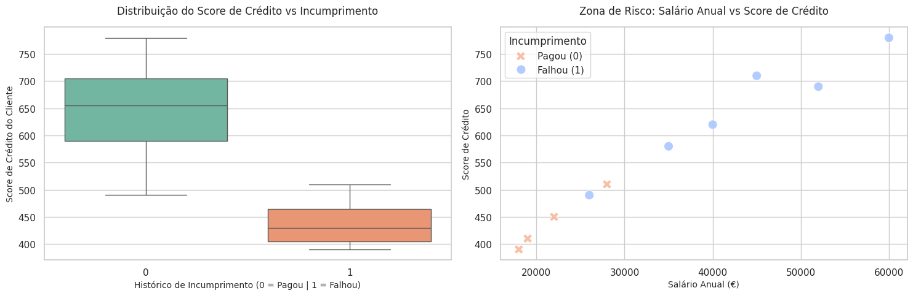

analisar-risco-crédito-banco:
Modelo de Machine Learning e Análise de Dados para Previsão de Incumprimento de Crédito.
# 🏦 Previsão de Risco de Crédito em Banca com Machine Learning

Este projeto foi desenvolvido para demonstrar a aplicação prática de Ciência de Dados e Machine Learning no setor financeiro, alinhando competências de tecnologia (Python/SQL) com decisões estratégicas de gestão de risco bancário.

## 🎯 Objetivo de Negócio
O objetivo é mitigar o risco de crédito do banco através da criação de um modelo preditivo (Árvore de Decisão). O modelo analisa o perfil dos clientes para prever a probabilidade de incumprimento (*credit default*), permitindo ao banco tomar decisões automatizadas de aprovação ou rejeição de empréstimos.

## 📊 Análise Visual dos Dados
Identificação da "Zona de Perigo" cruzando o histórico de pagamentos com as finanças dos clientes:

*Principais Conclusões:*
* Clientes com histórico de incumprimento apresentam um Score de Crédito significativamente mais baixo.
* O nível salarial isolado não é garantia de pagamento se o Score de Crédito for crítico.

## 🛠️ Tecnologias Utilizadas
* **Linguagem:** Python
* **Manipulação de Dados:** Pandas, NumPy
* **Visualização:** Seaborn, Matplotlib
* **Machine Learning:** Scikit-Learn (DecisionTreeClassifier)

## 📈 Próximos Passos
* Implementar a extração e limpeza destes dados utilizando consultas avançadas em **SQL**.
* Escalar o modelo utilizando um conjunto de dados massivo (Kaggle) com milhares de clientes reais.
